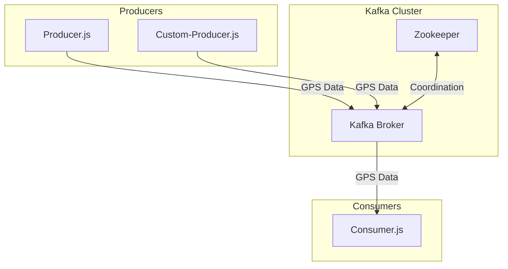

# Kafka GPS Data Application - Architecture Overview

## Introduction

This application demonstrates a simple Kafka-based streaming architecture for processing GPS data from different device types (GARMIN, SUUNTO, TUG). The architecture follows a producer-consumer pattern common in event-driven systems.

## System Components

The application consists of the following main components:

1. **Kafka Broker**: Message broker that receives and distributes GPS data messages
2. **Zookeeper**: Coordination service required by Kafka
3. **GPS Data Producers**: Components that generate and send GPS data to Kafka
4. **GPS Data Consumer**: Component that processes GPS data from Kafka

## Architecture Diagram

## Data Flow

1. **GPS Data Generation**: Producers create GPS data points with location, timestamp, and device type
2. **Message Publication**: Data is serialized as JSON and published to the 'gps-data' Kafka topic
3. **Message Consumption**: Consumer reads from the topic, deserializes the data, and displays/analyzes it

## Technologies Used

- **Node.js**: Runtime environment for JavaScript
- **KafkaJS**: Client library for interacting with Kafka
- **Docker**: Container platform for running Kafka and Zookeeper
- **Docker Compose**: Tool for defining and running multi-container applications

## Deployment Architecture

The system uses Docker Compose to deploy Kafka and Zookeeper, while the Node.js applications run directly on the host machine. This simple architecture allows for easy development and testing while maintaining a realistic Kafka environment.