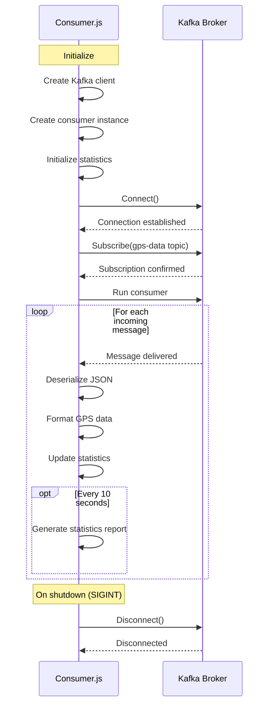

# Consumer Component

## Overview

The consumer component (`consumer.js`) is responsible for reading GPS data messages from Kafka, processing them, and displaying the results. It also maintains statistics about the different types of GPS devices and provides periodic reports.

## Consumer Sequence Diagram

## Key Functions

### formatGpsData()

Formats a GPS data point for display:
- Input: JSON object with timestamp, long, lat, and type
- Output: Formatted string showing device type, coordinates, and timestamp

### updateStats()

Updates statistics for received GPS data:
- Increments total messages counter
- Increments counter for the specific device type
- Generates a report every 10 seconds showing:
  - Total messages received
  - Count and percentage for each device type

### consumeMessages()

Main function that:
1. Connects to Kafka
2. Subscribes to the 'gps-data' topic
3. Sets up message processing
4. Handles graceful shutdown

## Error Handling

The consumer includes error handling:
- Try-catch blocks around message processing
- Connection error handling
- Graceful shutdown on SIGINT signal

## Configuration

The consumer uses the following configuration:
- Kafka broker: localhost:9094
- Client ID: my-app-consumer
- Consumer group: gps-data-group
- Topic: gps-data
- FromBeginning: true (reads all available messages)