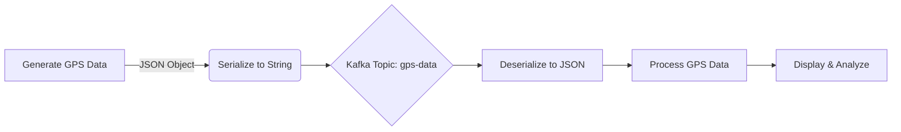

# GPS Data Model

## Overview

The application uses a consistent GPS data model across all components. This document describes the structure, validation, and handling of GPS data throughout the system.

## GPS Data Structure

Each GPS data point is represented as a JSON object with the following properties:

```json
{
  "timestamp": "2025-04-18T08:12:45.123Z",  // ISO 8601 timestamp
  "long": 10.123456,                        // Longitude (-180 to +180)
  "lat": 50.123456,                         // Latitude (-90 to +90)
  "type": "GARMIN"                          // Device type: GARMIN, SUUNTO, or TUG
}
```

### Properties

| Property  | Type   | Description                                         | Range/Format                |
|-----------|--------|-----------------------------------------------------|----------------------------|
| timestamp | String | Time when the GPS reading was taken                 | ISO 8601 datetime string   |
| long      | Number | Longitude coordinate                                | -180.0 to +180.0 degrees   |
| lat       | Number | Latitude coordinate                                 | -90.0 to +90.0 degrees     |
| type      | String | Type of device that generated the GPS reading       | GARMIN, SUUNTO, or TUG     |

## Data Flow Diagram



## Data Validation

In the current implementation, basic validation is performed:
- Device type is checked against the allowed values (GARMIN, SUUNTO, TUG)
- Coordinates are generated within valid ranges (-180 to +180 for longitude, -90 to +90 for latitude)

For a production system, additional validation would be recommended:
- Schema validation using JSON Schema
- Invalid message handling
- Error topic for messages that fail validation