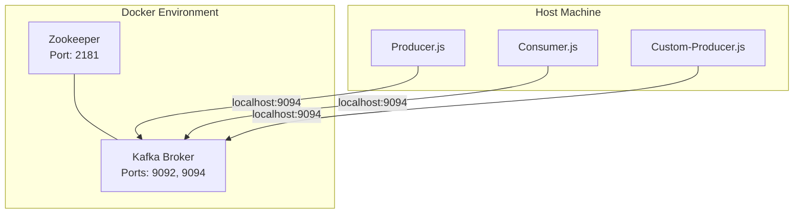
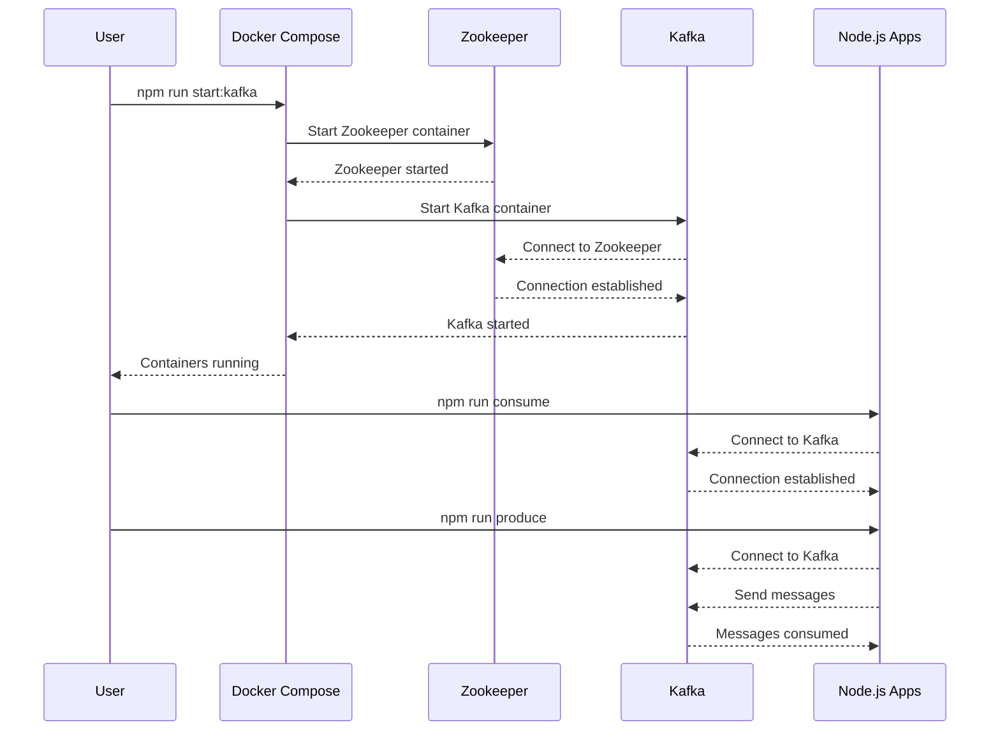

# Infrastructure and Deployment

## Overview

This document describes the infrastructure components of the Kafka GPS Data application, focusing on the Kafka cluster setup and Docker configuration.

## Docker Compose Configuration

The application uses Docker Compose to deploy Kafka and Zookeeper. The configuration is defined in `docker-compose.yml`.

### Component Diagram

### Kafka Configuration

The Kafka broker is configured with the following key settings:

- **KAFKA_BROKER_ID**: Unique identifier for the broker (set to 1)
- **KAFKA_ZOOKEEPER_CONNECT**: Connection to Zookeeper (zookeeper:2181)
- **KAFKA_ADVERTISED_LISTENERS**: Configures two listeners:
  - PLAINTEXT://kafka:9092 (for internal Docker network)
  - PLAINTEXT_HOST://localhost:9094 (for host machine access)
- **KAFKA_LISTENER_SECURITY_PROTOCOL_MAP**: Maps protocols for the listeners
- **KAFKA_INTER_BROKER_LISTENER_NAME**: Internal communication listener (PLAINTEXT)
- **KAFKA_OFFSETS_TOPIC_REPLICATION_FACTOR**: Replication factor for offset topics (1 for development)

### Zookeeper Configuration

Zookeeper is configured with:

- **ZOOKEEPER_CLIENT_PORT**: Port for client connections (2181)
- **ZOOKEEPER_TICK_TIME**: Basic time unit in milliseconds (2000)

## Deployment Sequence

## Scaling Considerations

For production environments, consider:

1. **Multi-node Kafka cluster**: Increase the number of Kafka brokers
2. **Replication factor**: Increase from 1 to 3 for fault tolerance
3. **Persist data volumes**: Mount volumes for Kafka and Zookeeper to persist data
4. **Network configuration**: Configure security, SASL, and proper network controls
5. **Monitoring**: Add monitoring and alerting for the Kafka cluster