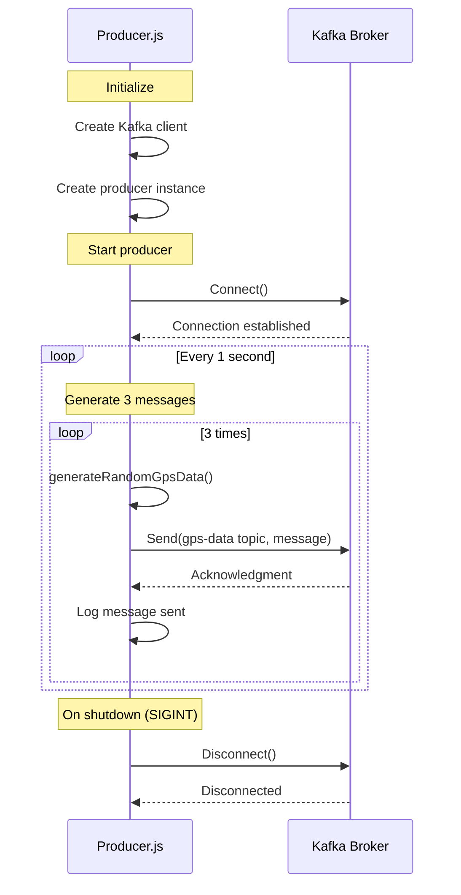
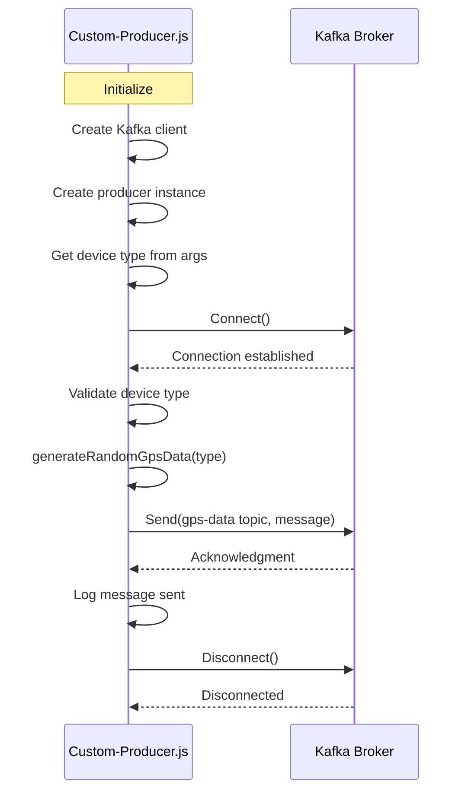

# Producer Components

## Overview

The application includes two producer components:

1. **producer.js** - Continuously generates random GPS data (3 messages/second)
2. **custom-producer.js** - Sends a single GPS message with a specified device type

## Producer Sequence Diagram

### Continuous Producer (producer.js)

### Custom Producer (custom-producer.js)

## Key Functions

### generateRandomGpsData()

Generates a random GPS data point with the following properties:
- timestamp: Current time in ISO format
- long: Random longitude (-180 to +180)
- lat: Random latitude (-90 to +90)
- type: GARMIN, SUUNTO, or TUG (random or specified)

### sendGpsMessage()

Sends a single GPS message to Kafka:
1. Generates GPS data
2. Serializes to JSON
3. Sends to the 'gps-data' topic
4. Logs the result

### startProducer()

Main function in producer.js that:
1. Connects to Kafka
2. Sets up an interval to send 3 messages per second
3. Handles graceful shutdown

## Configuration

Both producers use the following configuration:
- Kafka broker: localhost:9094
- Client ID: my-app
- Topic: gps-data